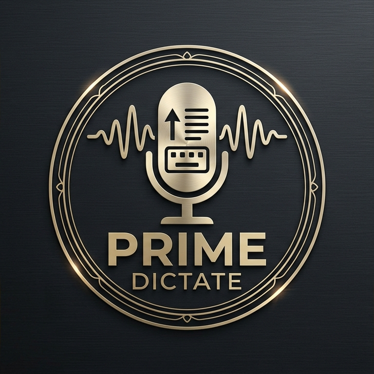

<p align="center">
  
</p>

<h1 align="center">PrimeDictate</h1>

<p align="center">
  <strong>Private, system-wide dictation for Windows.</strong><br>
  Local CPU and GPU transcription, optional cloud STT, and independent text processing in one desktop workflow.
</p>

<p align="center">
  <a href="LICENSE"></a>
  
  
  
  
</p>

PrimeDictate records speech from a global Windows hotkey, transcribes it with a selected local or cloud engine, optionally processes the transcript, and safely inserts the result into the window that was active when recording began.

It is designed around an explicit two-stage pipeline:

```text
Microphone or media file
        |
        v
1. Speech to Text (required)
   Local CPU / CUDA / Vulkan, or cloud STT
        |
        v
2. Text Processing (optional)
   Rule-based cleanup, local LLM, or cloud LLM
        |
        v
Clipboard injection, history, or file output
```

The transcription model and text-processing model are configured independently. Selecting cloud STT does not select a cloud text model, and selecting a cloud text model does not upload audio.

## Highlights

- System-wide dictation with configurable toggle or hold hotkeys.
- Local Whisper inference on CPU, NVIDIA CUDA, or Vulkan-capable GPUs.
- Cloud transcription through Groq, OpenAI, or Google Gemini Audio.
- Searchable Whisper language catalog with 100 languages and automatic detection.
- Complete Turkish and English application interfaces.
- Optional rule-based cleanup, Ollama/LM Studio processing, or cloud LLM processing.
- Cancellable, chunked transcription for common audio and video formats.
- Multi-monitor-safe recording overlay with remembered drag position.
- Plain-text clipboard restoration and focus-safe paste behavior.
- API credentials stored in Windows Credential Manager.
- Portable and installed editions with the same per-user data model.
- Live diagnostics for engines, devices, downloads, and provider failures.

## Engine Selection

### Speech-to-text engines

| Engine | Processing location | Primary use | Model selection | Audio leaves device |
|---|---|---|---|---|
| Local CPU | This computer | Maximum compatibility and privacy | `tiny` through `large-v3-turbo` | No |
| NVIDIA CUDA | NVIDIA GPU | Fast local transcription | `tiny` through `large-v3-turbo` | No |
| Vulkan | AMD, Intel, or NVIDIA GPU | Local GPU acceleration through whisper.cpp | GGML equivalent of selected size | No |
| Groq STT | Groq infrastructure | Low-latency cloud Whisper | Groq transcription model | Yes |
| OpenAI STT | OpenAI infrastructure | Managed cloud transcription | OpenAI transcription model | Yes |
| Gemini Audio | Google infrastructure | Multimodal cloud transcription | Gemini model | Yes |

Local model size is shown only for local engines. When cloud STT is active, PrimeDictate instead displays the selected provider and remote transcription model.

Cloud fallback is opt-in. If enabled, audio may be sent to the configured cloud STT provider only after the selected local engine fails.

### Text-processing methods

| Method | Processing location | Model required | Data sent |
|---|---|---|---|
| Rule-based cleanup | This computer | No | Nothing |
| Ollama / LM Studio | User-configured local endpoint | Yes | Transcript text |
| Gemini / Grok / Groq / OpenAI | Provider infrastructure | Yes | Transcript text |

Text processing is optional. When disabled, the raw STT result is used without cleanup or rewriting.

Available profiles include standard cleanup, formal business writing, technical terminology preservation, English translation, and bullet-point summarization. Profiles and custom instructions apply only to LLM-based processing; the local rule-based method performs basic filler removal, capitalization, spacing, and punctuation.

## Language Support

PrimeDictate separates interface language from spoken language:

| Setting | Current support |
|---|---|
| Application interface | Turkish and English |
| Spoken language | 100 Whisper language codes |
| Automatic language detection | Supported |

CPU and CUDA engines can expose detected-language confidence. During file transcription, a detected language is locked only when confidence is at least 60%, so later chunks remain consistent without trusting a weak first guess. Some providers and the Vulkan CLI do not expose confidence metadata; PrimeDictate does not fabricate a confidence value when one is unavailable.

## Requirements

### End users

- Windows 10 or Windows 11, 64-bit.
- A working microphone for live dictation.
- Sufficient storage for local Whisper models when a local engine is selected.
- A current compatible driver for CUDA or Vulkan acceleration.
- Provider credentials only for cloud features selected by the user.

### Source development

- Python 3.12.
- Git.
- Inno Setup 6 only when producing the Windows setup package.

## Run From Source

```powershell
git clone https://github.com/MaximusPrime/PrimeDictate.git
Set-Location PrimeDictate

python -m venv .venv
.\.venv\Scripts\Activate.ps1
python -m pip install --upgrade pip
python -m pip install -r requirements.txt

python run.py
```

PrimeDictate prevents multiple application instances for the same Windows user. If the application is already running, open it from the system tray instead of starting a second process.

## First-Time Configuration

1. Open **Speech to Text** and select the processing location.
2. For a local engine, select and download a Whisper model.
3. For cloud STT, select the provider, remote model, and required API credential.
4. Select the spoken language or use automatic detection.
5. Open **Text Processing & API** and decide whether transcript processing should be enabled.
6. Open **Audio & Shortcuts** to select a microphone, hotkey behavior, and interface language.
7. Save settings, focus a target application, and use the configured global hotkey.

The default hotkey is `Ctrl+Alt+D` in toggle mode.

For a detailed Turkish walkthrough, see [docs/USER_GUIDE_TR.md](docs/USER_GUIDE_TR.md).

## Local Model Guidance

| Model | Relative speed | Relative memory | Typical use |
|---|---|---|---|
| `tiny` | Fastest | Lowest | Short commands and constrained hardware |
| `base` | Very fast | Low | General lightweight dictation |
| `small` | Balanced | Moderate | Everyday dictation with improved accuracy |
| `medium` | Slower | High | Accuracy-focused local transcription |
| `large-v3-turbo` | Hardware-dependent | Highest | Strong multilingual accuracy on capable systems |

Actual performance depends on the processor, GPU, driver, recording quality, language, and model backend. Model names do not imply identical memory usage across faster-whisper and GGML runtimes.

## Vulkan Runtime

PrimeDictate includes a pinned Windows x64 whisper.cpp runtime built with Vulkan support:

- Upstream release: `v1.9.2`
- Build option: `GGML_VULKAN=ON`
- Runtime manifest: `runtime/whisper-vulkan/SHA256SUMS`
- Provenance: [runtime/whisper-vulkan/PROVENANCE.md](runtime/whisper-vulkan/PROVENANCE.md)

At runtime, PrimeDictate verifies bundled files against the SHA-256 manifest, confirms that the selected CLI exposes the Vulkan backend, and reports the detected Vulkan device. A custom `whisper-cli.exe` can be selected as an advanced override.

Vulkan availability still depends on the installed graphics driver and hardware support. Bundling a Vulkan-enabled runtime does not guarantee that every GPU or driver combination will execute it successfully.

## Privacy and Data Flow

PrimeDictate does not treat “portable” as “store data beside the executable.” Both installed and portable editions use the current Windows user profile:

```text
%APPDATA%\PrimeDictate\
|-- config.json       Application settings; no API credentials
|-- history.json      Optional local transcript history
`-- models\
    |-- faster-whisper\   Managed CPU/CUDA models
    `-- whisper.cpp\      Managed Vulkan GGML models
```

API credentials are written to Windows Credential Manager under PrimeDictate-specific credential targets.

| Configuration | Audio destination | Transcript destination |
|---|---|---|
| Local STT + rule-based cleanup | This computer | This computer |
| Local STT + local LLM | This computer | Configured local endpoint |
| Local STT + cloud LLM | This computer | Selected LLM provider |
| Cloud STT | Selected STT provider | Depends on processing selection |
| Local STT + cloud fallback | Cloud only after local failure | Depends on processing selection |

Clipboard insertion captures the target window before recording, attempts to restore that focus safely, and pastes with `Ctrl+V`. PrimeDictate can restore the previous plain-text clipboard value; it does not preserve images, copied files, HTML, or other clipboard formats. If focus cannot be restored safely, the result remains on the clipboard instead of being pasted into an unintended window.

## File Transcription

Supported input containers include:

```text
.mp3  .wav  .mp4  .m4a  .mkv  .flac  .ogg
```

Media is decoded incrementally and processed in bounded chunks. Cancellation is cooperative: CPU/CUDA stop at segment boundaries, Vulkan terminates its active CLI process, and an in-flight provider HTTP request may need to return before cancellation completes. The selected STT and optional text-processing configuration also applies to file transcription.

## Build

The automated Windows build produces a one-file portable executable, an onedir application, and an installer when Inno Setup is available:

```powershell
.\.venv\Scripts\python.exe build.py
```

Expected outputs:

```text
dist\PrimeDictate-Portable.exe
dist\PrimeDictate\PrimeDictate.exe
dist\PrimeDictate-Setup.exe          # when ISCC.exe is available
```

The PyInstaller specs can also be invoked directly:

```powershell
.\.venv\Scripts\python.exe -m PyInstaller --noconfirm --clean PrimeDictate-Portable.spec
.\.venv\Scripts\python.exe -m PyInstaller --noconfirm --clean PrimeDictate.spec
```

Build metadata is sourced from `src/metadata.py`. Inno Setup declarations in `installer.iss` must remain synchronized with that canonical metadata.

## Test

```powershell
.\.venv\Scripts\python.exe -m unittest discover -s tests -v
.\.venv\Scripts\python.exe -m compileall -q src run.py build.py
```

The suite covers STT dispatch, language validation, cloud request contracts, fallback consent, file chunking, credential persistence, clipboard safety, localization, navigation consistency, overlay positioning, and package resource declarations.

## Architecture

```text
PrimeDictate/
|-- run.py                         Application controller and state machine
|-- build.py                       Windows packaging automation
|-- installer.iss                  Inno Setup definition
|-- src/
|   |-- config.py                  Settings, credentials, prompts, languages
|   |-- i18n.py                    Turkish and English interface catalog
|   |-- metadata.py                Canonical product metadata
|   |-- audio/                     Capture, resampling, and VAD
|   |-- engine/                    STT, models, file transcription, cleanup
|   |-- hotkey/                    Global Windows hotkey listener
|   |-- injector/                  Focus-safe clipboard insertion
|   `-- ui/                        Main window, overlay, tray, and styling
|-- runtime/whisper-vulkan/        Pinned Vulkan runtime and provenance
|-- tests/                          Core and UI regression tests
`-- docs/                           User and engineering documentation
```

See [docs/ARCHITECTURE.md](docs/ARCHITECTURE.md) for component contracts and data-flow details.

## Known Boundaries

- PrimeDictate is currently Windows-only.
- Cloud functionality depends on provider availability, account access, model availability, quotas, and API contract changes.
- Gemini Audio language guidance is prompt-based rather than a structured Whisper language field.
- Automatic language confidence is shown only when the active engine exposes it.
- A successful package build does not replace testing on the intended CPU, GPU, driver, microphone, and Windows configuration.
- PrimeDictate produces and inserts text; it does not execute spoken operating-system commands.

## Documentation

- [Turkish User Guide](docs/USER_GUIDE_TR.md)
- [Architecture](docs/ARCHITECTURE.md)
- [Contributing](CONTRIBUTING.md)
- [Security Policy](SECURITY.md)
- [Vulkan Runtime Provenance](runtime/whisper-vulkan/PROVENANCE.md)
- [License](LICENSE)

## License

PrimeDictate is licensed under the [GNU General Public License v3.0](LICENSE).

The bundled whisper.cpp runtime retains its upstream license in [runtime/whisper-vulkan/LICENSE.whisper.cpp.txt](runtime/whisper-vulkan/LICENSE.whisper.cpp.txt). Third-party packages remain subject to their respective licenses.

## Project and Support

| | |
|---|---|
| Product | PrimeDictate |
| Version | 1.0.0 |
| Studio | Maximus Prime Software |
| Website | [maximusprimesoftware.pages.dev](https://maximusprimesoftware.pages.dev/) |
| Product page | [PrimeDictate](https://maximusprimesoftware.pages.dev/projects/primedictate/) |
| Repository | [github.com/MaximusPrime/PrimeDictate](https://github.com/MaximusPrime/PrimeDictate) |
| Email | [maximusprimesoftware@gmail.com](mailto:maximusprimesoftware@gmail.com) |

<p align="center">
  <a href="https://maximusprimesoftware.pages.dev/">
    
  </a>
</p>

<p align="center">
  <strong>Designed and developed by Maximus Prime Software.</strong><br>
  <sub>Private by design. Built for productive Windows workflows.</sub>
</p>
