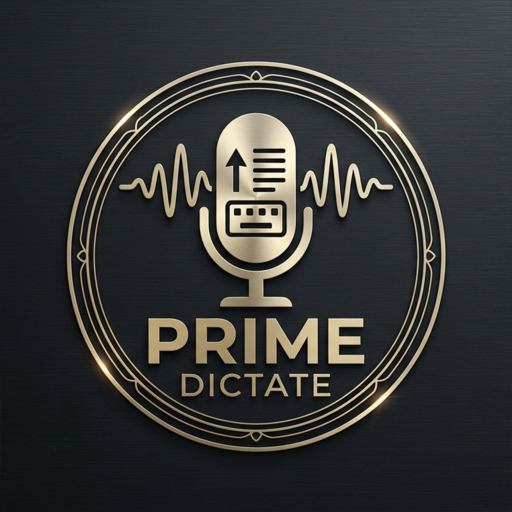
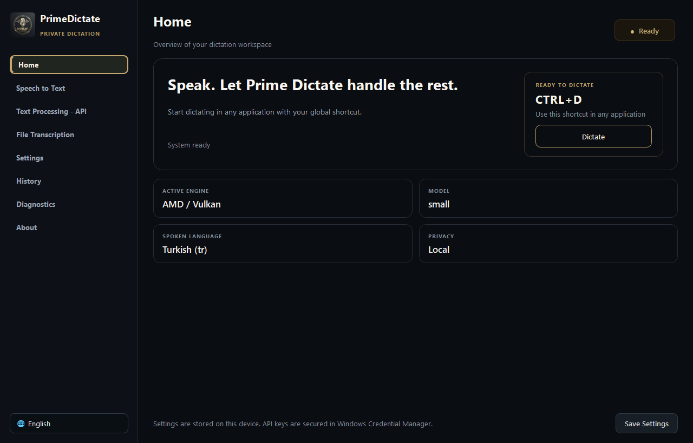
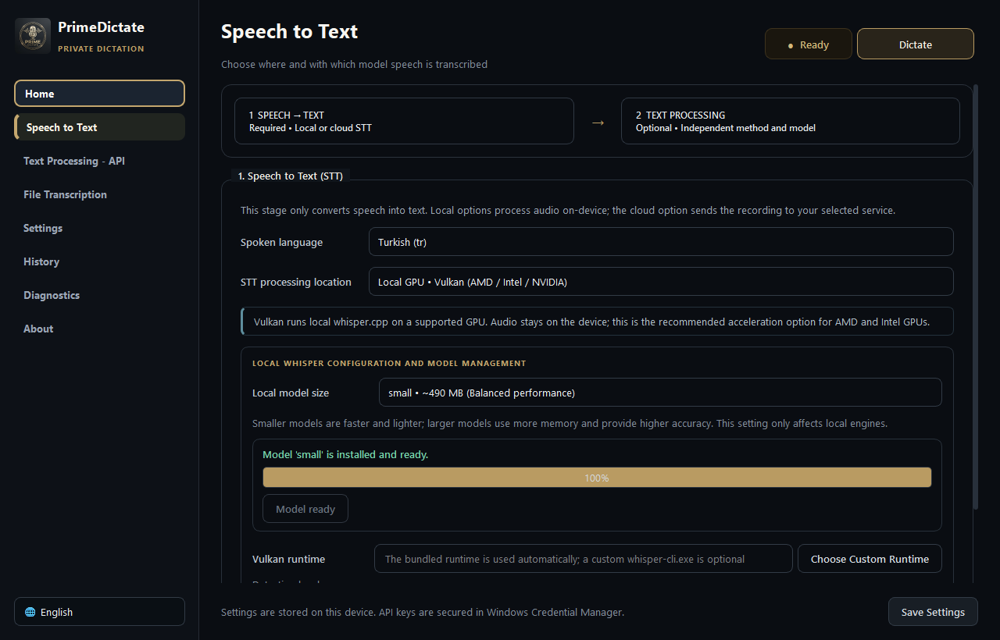
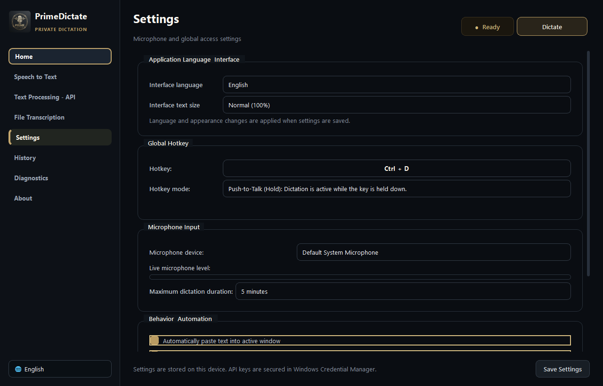
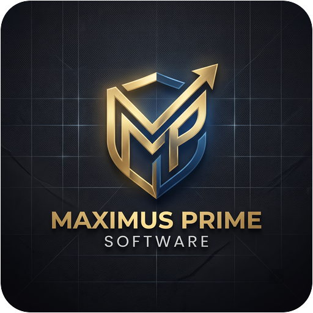

<p align="center">
  
</p>

<h1 align="center">PrimeDictate</h1>

<p align="center">
  <strong>Private, system-wide dictation for Windows.</strong><br>
  Fast local CPU/GPU transcription, optional cloud services, and safe text insertion in one desktop workflow.
</p>

<p align="center">
  <a href="LICENSE"></a>
  
  
  
</p>

PrimeDictate records from a global hotkey, transcribes with the selected local or cloud engine, optionally cleans or rewrites the result, and safely inserts it into the window that was active when recording started. Speech-to-text and text processing are independent stages: using local STT never requires a cloud text model, and selecting cloud text processing does not upload audio.

<p align="center">
  
</p>

## Highlights

- System-wide dictation with configurable **Toggle** and **Push-to-Talk (Hold)** modes.
- Local Whisper on CPU, NVIDIA CUDA, or Vulkan-capable AMD/Intel/NVIDIA GPUs.
- Persistent loopback-only Vulkan inference with background model warmup for fast consecutive dictation.
- Separate managed models for faster-whisper (CPU/CUDA) and whisper.cpp GGML (Vulkan).
- Optional Groq, OpenAI, and Gemini Audio cloud transcription.
- Optional rule-based cleanup, local Ollama/LM Studio, or cloud LLM processing.
- Turkish and English interfaces backed by complete, matching locale catalogs.
- Adaptive voice activity detection, bounded recordings, and background finalization.
- Chunked, cancellable media transcription with overlap de-duplication and TXT/SRT/VTT/JSON export.
- Focus-safe paste, clipboard restoration, searchable local history, and a draggable multi-monitor overlay with explicit processing/ready feedback.
- Credentials in Windows Credential Manager, redacted rotating logs, and privacy-safe diagnostic ZIPs.
- State-aware system tray controls and single-instance application lifecycle.

## Screenshots

| Speech-to-text and model management | Hotkey and audio settings |
|---|---|
|  |  |

Floating dictation control:

<p align="center">
  
</p>

## How the Pipeline Works

```text
Microphone or media file
        |
        v
1. Speech to Text (required)
   CPU / CUDA / Vulkan / cloud STT
        |
        v
2. Text Processing (optional)
   Rules / local LLM / cloud LLM
        |
        v
Safe paste / history / file export
```

Cloud fallback is disabled by default and requires explicit consent. When enabled, audio is sent to the configured cloud STT provider only after the chosen local engine fails.

## Engine Guide

| Engine | Best fit | Runtime and models | Audio leaves device |
|---|---|---|---|
| Local CPU | Compatibility, short dictation, modern fast CPUs | faster-whisper; managed CPU model cache | No |
| NVIDIA CUDA | Sustained high-throughput local transcription | faster-whisper; managed CUDA model cache | No |
| Vulkan | AMD/Intel GPU acceleration and supported NVIDIA systems | whisper.cpp; separate GGML models | No |
| Groq/OpenAI/Gemini STT | Low local resource use or cloud preference | Provider-managed models | Yes |

CPU and GPU can be changed later in **Speech to Text**; the first-run choice is not permanent. PrimeDictate validates the chosen backend, reports the detected device, and prevents incompatible model/backend combinations.

PrimeDictate warms the selected local engine in the background after startup. The bundled Vulkan path keeps the selected GGML model in a loopback-only `whisper-server` process, avoiding repeated process and model-loading cost during consecutive dictation. If the persistent server cannot start or answer, PrimeDictate automatically falls back to its verified one-shot CLI path. CPU may still win on some systems, and CUDA is typically preferred on a supported NVIDIA GPU; measure on the target hardware because model size, driver, CPU, GPU, and recording length all matter.

The floating control shows **Transcribing** while a result is pending. As soon as the result is available, dictation returns to idle immediately and the Play control becomes available; no artificial success cooldown is imposed. Diagnostic logs include `Dictation stop-to-result latency=...` for end-to-end measurement.

Supported local sizes depend on the runtime. CPU/CUDA use faster-whisper model packages; Vulkan uses compatible whisper.cpp GGML packages and therefore stores a separate copy. `large-v3` is not offered where the bundled Vulkan catalog has no compatible artifact; `large-v3-turbo` is the high-end Vulkan option.

## First Run

1. Open **Speech to Text** and choose CPU, CUDA, Vulkan, or cloud STT.
2. For a local engine, choose and download a compatible model.
3. Select the spoken language or automatic detection.
4. Optionally configure cleanup or LLM processing under **Text Processing - API**.
5. In **Settings**, select the microphone, assign a safe global hotkey, and choose Toggle or Hold mode.
6. Save, focus any text field, and use the configured shortcut.

The default shortcut is `Ctrl+Alt+D`. Ordinary unmodified keys are rejected to prevent accidental global capture; function keys may be assigned alone. Hotkeys are registered live and invalid saved values fall back safely.

## Local Models and Data

Installed and portable editions use the current Windows profile rather than writing personal data beside the executable:

```text
%APPDATA%\PrimeDictate\
|-- config.json
|-- history.json
|-- logs\PrimeDictate.log
`-- models\
    |-- faster-whisper\   CPU/CUDA packages
    `-- whisper.cpp\      Vulkan GGML packages
```

API credentials are stored in Windows Credential Manager. Diagnostic bundles redact tokens, provider secrets, and Windows user-profile paths; they do not include transcript history, recordings, or API credentials.

Clipboard insertion remembers the target window before recording and restores focus only when safe. If the target cannot be restored, the result remains on the clipboard instead of being pasted into an unintended window. Plain-text clipboard restoration does not preserve images, file lists, HTML, or other rich formats.

## File Transcription

Supported containers include `.mp3`, `.wav`, `.mp4`, `.m4a`, `.mkv`, `.flac`, and `.ogg`. Long media is decoded incrementally, processed in overlapping bounded chunks, and de-duplicated at chunk boundaries. Jobs can be cancelled; CPU/CUDA stop at safe segment boundaries, a persistent Vulkan or cloud HTTP request may first need to return, and the one-shot Vulkan fallback terminates its active CLI process.

Exports include plain text plus timestamp-aware SRT, VTT, and JSON formats.

## Requirements

For packaged releases:

- Windows 10 or 11, 64-bit.
- A microphone for live dictation.
- Current compatible GPU drivers when using CUDA or Vulkan.
- Enough storage for each selected backend's model files.

For source development: Python 3.12, Git, and Inno Setup 6 when producing the installer.

## Run from Source

```powershell
git clone https://github.com/MaximusPrime/PrimeDictate.git
Set-Location PrimeDictate
python -m venv .venv
.\.venv\Scripts\Activate.ps1
python -m pip install --upgrade pip
python -m pip install -r requirements.txt
python run.py
```

Only one PrimeDictate instance runs per Windows user. Use the tray icon to reopen a running instance.

## Quality Checks

```powershell
.\.venv\Scripts\python.exe -m compileall -q src run.py build.py
.\.venv\Scripts\python.exe build.py --check
.\.venv\Scripts\python.exe -m unittest discover -s tests -v
```

The regression suite covers backend dispatch and device validation, model catalogs, cloud contracts and consent, hotkey Toggle/Hold behavior, localization parity, operation coordination, file chunking/export, clipboard safety, diagnostics, navigation, overlay placement, and package resources. Windows CI runs the same compile, preflight, and test checks.

## Build Windows Packages

```powershell
.\.venv\Scripts\python.exe build.py
```

Expected outputs:

```text
dist\PrimeDictate-Portable.exe
dist\PrimeDictate\PrimeDictate.exe
dist\PrimeDictate-Setup.exe
```

The build uses the tracked PyInstaller specifications and validates locale catalogs, assets, metadata, and the bundled Vulkan integrity manifest before packaging. Inno Setup must be installed for `PrimeDictate-Setup.exe`.

## Project Layout

```text
PrimeDictate/
|-- run.py                       Controller and application state machine
|-- build.py                     Validation and Windows packaging
|-- installer.iss                Inno Setup definition
|-- src/
|   |-- audio/                   Capture, resampling, adaptive VAD
|   |-- engine/                  STT, models, providers, file jobs
|   |-- hotkey/                  Global shortcut listener and validation
|   |-- injector/                Focus-safe clipboard insertion
|   |-- locales/                 English and Turkish JSON catalogs
|   `-- ui/                      Window, pages, tray, overlay, styling
|-- runtime/whisper-vulkan/      Pinned CLI/server runtime, hashes, provenance
|-- tests/                        Core and UI regression tests
`-- docs/                         Guides, architecture, screenshots
```

See [Architecture](docs/ARCHITECTURE.md) for component contracts and data flow.

## Verification Boundaries

- The application is Windows-only.
- Vulkan behavior depends on the installed driver and hardware despite runtime preflight checks. The persistent server binds only to loopback on a random port with a per-process unguessable request path.
- CUDA paths, catalogs, and failure handling are covered by automated tests, but this release was not physically benchmarked on an NVIDIA card by the maintainer producing these artifacts.
- Cloud behavior also depends on provider availability, account access, quota, and API changes.
- A successful build cannot replace validation on the target microphone, CPU/GPU, driver, and Windows configuration.
- PrimeDictate produces text; it does not execute spoken operating-system commands.

## Documentation and Support

- [Turkish User Guide](docs/USER_GUIDE_TR.md)
- [Architecture](docs/ARCHITECTURE.md)
- [Contributing](CONTRIBUTING.md)
- [Security Policy](SECURITY.md)
- [Vulkan Runtime Provenance](runtime/whisper-vulkan/PROVENANCE.md)
- [GPL-3.0 License](LICENSE)

Project: [PrimeDictate](https://maximusprimesoftware.pages.dev/projects/primedictate/) · Website: [Maximus Prime Software](https://maximusprimesoftware.pages.dev/) · Email: [maximusprimesoftware@gmail.com](mailto:maximusprimesoftware@gmail.com)

<p align="center">
  <a href="https://maximusprimesoftware.pages.dev/"></a>
</p>

<p align="center"><strong>Private by design. Built for productive Windows workflows.</strong></p>
