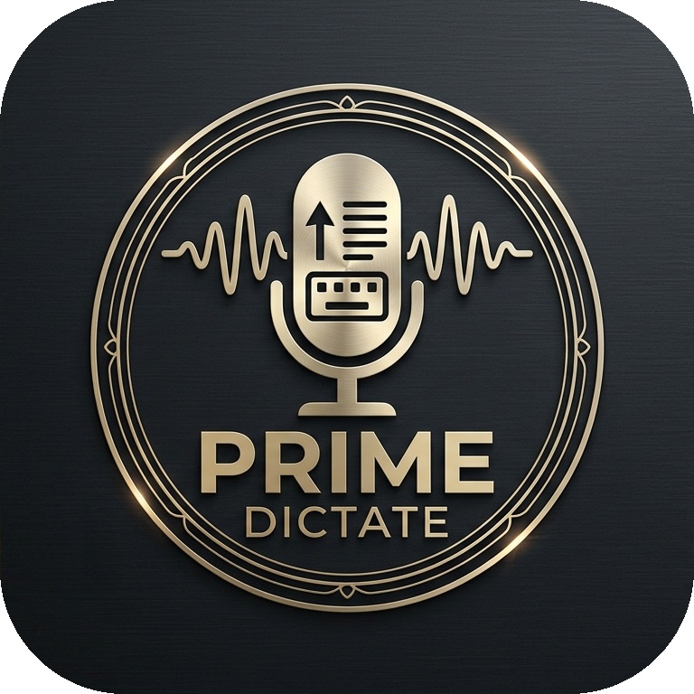

<p align="center">
  
</p>

<h1 align="center">PrimeDictate</h1>

<p align="center">
  <b>System-wide Speech-to-Text & AI Voice Assistant Application for Windows</b><br/>
  <i>Hardware-accelerated local dictation for AMD/Intel/NVIDIA GPUs, private CPU operation, and optional cloud transcription and text processing.</i>
</p>

<p align="center">
  
  
  
  
  
  
  
</p>

---

## 🚀 Key Features

- 🎙️ **System-wide Global Dictation**: Press a custom hotkey (`Ctrl+Alt+D` or `F9`) from any window to record voice and auto-paste clean text instantly.
- 🧠 **AI Assistant & Command Mode**: Switch from standard dictation to **AI Assistant Mode** to issue spoken commands (*"Summarize this text"*, *"Translate to English"*, *"Write a formal email"*). PrimeDictate executes your spoken instruction via AI and pastes the answer into your focused window!
- 📝 **5 Preset Prompt Rule Templates & Custom Rules**:
  - 📝 **Standard Dictation Cleanup**: Strips "eee", "hmmm", "yani", "şey" hesitation sounds, fixes punctuation and capitalization.
  - 💼 **Formal Business Language**: Rewrites spoken voice into polished, professional corporate correspondence.
  - 💻 **Coding & Tech Term Protection**: Preserves technical jargon, library names, and `CamelCase` / `snake_case` code variables.
  - 🌐 **Instant English Translation**: Translates Turkish spoken voice instantly to fluent English text.
  - 📊 **Summarize & Bullet Points**: Summarizes long audio into structured bullet points.
  - ✏️ **Custom User Rules**: Define your own custom AI instructions and rules.
- ⚡ **Flexible STT Engines**:
  - **AMD RDNA 2 and newer GPUs**: local whisper.cpp acceleration through a Vulkan-enabled runtime.
  - **NVIDIA GPUs**: CUDA & cuDNN (float16 / int8).
  - **Local CPU**: Multi-core int8 inference with no audio upload.
  - **Cloud STT**: User-selected Groq, OpenAI Transcribe, or Google Gemini Audio integration.
- 🔀 **Independent Model Pipeline**: The transcription provider/model and post-transcription cleanup provider/model are configured independently.
- 🌐 **Local & Custom LLM Support (Ollama / LM Studio / OpenRouter)**:
  - Connect to local AI models running on **Ollama** (`http://localhost:11434/v1`), **LM Studio**, or **OpenRouter** (`llama3.2`, `qwen2.5-coder`, `mistral`).
  - Configurable support for **Google Gemini**, **xAI Grok**, **Groq**, and **OpenAI** text models.
- 📁 **Audio & Video File Transcriber**: Chunked, cancellable transcription for `.mp3`, `.wav`, `.mp4`, `.m4a`, `.mkv`, `.flac`, and `.ogg` media files.
- 📥 **Async Local Model Downloader**: Progress manager for faster-whisper and whisper.cpp GGML models (`tiny`, `base`, `small`, `medium`, `large-v3-turbo`).
- 🔒 **Clipboard Auto-Paste & Restoration**: Safely pastes via `Ctrl+V` and automatically restores your previous clipboard content after 0.6s.
- 🛠️ **Dev Mode Live Diagnostic Console**: Live log stream tab for debugging audio devices, sample rates, model downloads, and API responses.
- 🌊 **Floating Audio Wave Visualizer**: Position-remembering, frameless, semi-transparent overlay pill showing live volume waves and state.
- 📌 **System Tray Integration**: Background operation with quick access tray menu.

---

## 🛠️ Installation & Quick Start

### Prerequisites
- Windows 10 / 11 (64-bit)
- Python 3.12+

### Setup & Run Source Code

```bash
# Clone the repository
git clone https://github.com/MaximusPrime/PrimeDictate.git
cd PrimeDictate

# Create virtual environment
python -m venv .venv
.venv\Scripts\activate

# Install dependencies
pip install -r requirements.txt

# Run PrimeDictate
python run.py
```

### AMD / Vulkan setup

AMD acceleration uses the real whisper.cpp Vulkan backend; it does not label CPU inference as GPU processing. PrimeDictate ships with a pinned, locally built whisper.cpp `v1.9.2` Vulkan runtime and verifies its SHA-256 manifest before use. A current Vulkan-capable AMD driver is still required.

```bash
Motor & Davranış → AMD / Intel / NVIDIA — Vulkan
```

PrimeDictate automatically discovers the bundled runtime, validates that the Vulkan backend is present, reports the detected GPU, and downloads the matching GGML model from the official whisper.cpp model repository. The custom runtime picker remains available only as an advanced override. RDNA 2 and newer AMD cards are the primary supported target; actual availability also depends on the installed Vulkan driver.

---

## 📦 Building Executables (Portable & Setup)

PrimeDictate includes an automated build script to generate standalone Windows binaries:

```bash
# Run build script to generate Portable & Setup packages
python build.py
```

### Outputs in `dist/`:
1. **Portable Edition (`dist/PrimeDictate-Portable.exe`)**:
   - Standalone `.exe` file running without installation.
2. **Windows Installer Setup (`dist/PrimeDictate-Setup.exe`)**:
   - Complete setup wizard created via Inno Setup (`ISCC.exe`).

---

## 📐 Architecture Overview

```
PrimeDictate/
├── run.py                          # Main Entry Point & App Controller
├── build.py                        # Automated Executable Builder (Portable & Setup)
├── installer.iss                   # Inno Setup Wizard Script
├── requirements.txt                # Python Dependencies
├── PrimeDictate-Logo.png           # App Branding Logo
└── src/
    ├── config.py                   # App Configuration Manager & Prompt Presets
    ├── audio/
    │   ├── recorder.py             # Low-latency Audio Stream & Resampler (44.1/48kHz -> 16kHz)
    │   └── vad.py                  # Voice Activity Detection & Micro-Recording Filter
    ├── engine/
    │   ├── engine_manager.py       # STT Engine Manager (Vulkan/CUDA/CPU/Cloud)
    │   ├── model_manager.py        # faster-whisper and GGML Model Manager
    │   ├── file_transcriber.py     # Audio & Video File Transcription Worker
    │   ├── stt_cuda.py             # NVIDIA GPU CUDA Engine
    │   ├── stt_vulkan.py           # whisper.cpp Vulkan CLI Engine
    │   ├── stt_cpu.py              # Multi-core local CPU engine
    │   ├── stt_cloud.py            # Groq, OpenAI & Gemini Cloud STT Engine
    │   └── ai_cleanup.py           # Multi-LLM AI Text Cleaner & Ollama Endpoint Client
    ├── hotkey/
    │   └── listener.py             # Win32 Global Hotkey Listener
    ├── injector/
    │   └── paste_injector.py       # Safe Clipboard & Active Window Injector
    └── ui/
        ├── main_window.py          # PySide6 Control Panel, AI Rules & File Transcriber UI
        ├── floating_overlay.py     # Position-Remembering Audio Visualizer Overlay Pill
        ├── styles.py               # Premium responsive Qt design system
        └── tray_icon.py            # Windows System Tray Integration
```

---

## 📄 License

This project is licensed under the **GNU General Public License v3.0 (GPL-3.0)** - see the [LICENSE](LICENSE) file for details.

---

## Author and support

| | |
|---|---|
| **Developer** | Maximus Prime |
| **Studio** | Maximus Prime Software |
| **Website** | [maximusprimesoftware.pages.dev](https://maximusprimesoftware.pages.dev/) |
| **Product page** | [PrimeDictate](https://maximusprimesoftware.pages.dev/projects/primedictate/) |
| **Studio email** | [maximusprimesoftware@gmail.com](mailto:maximusprimesoftware@gmail.com) |
| **GitHub** | [@MaximusPrime](https://github.com/MaximusPrime) |
| **Repository** | [MaximusPrime/PrimeDictate](https://github.com/MaximusPrime/PrimeDictate) |

---

<div align="center">
  <h3>Maximus Prime Software</h3>
  <a href="https://maximusprimesoftware.pages.dev/">
    
  </a>
  <p>
    <strong>Designed and developed by Maximus Prime Software.</strong><br>
    <sub>Private by design. Built for productive Windows workflows.</sub><br>
    <a href="https://maximusprimesoftware.pages.dev/">maximusprimesoftware.pages.dev</a> ·
    <a href="https://github.com/MaximusPrime">@MaximusPrime</a>
  </p>
</div>
